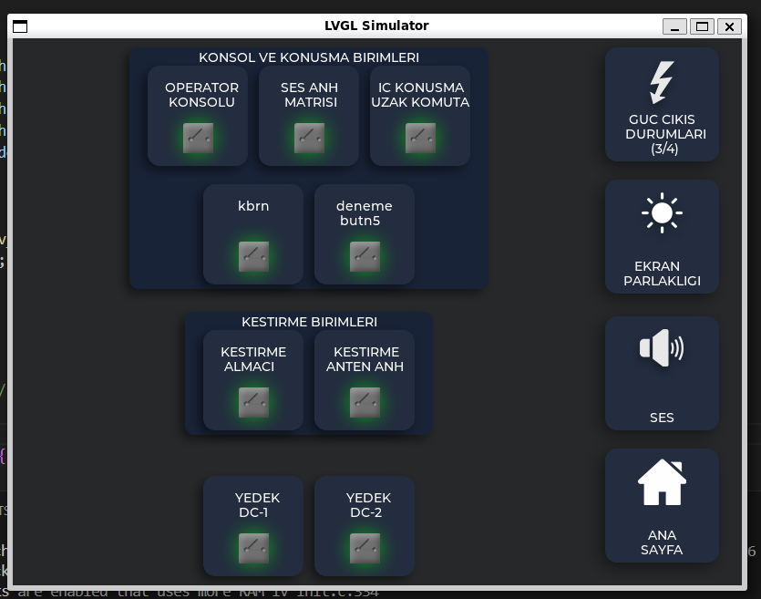
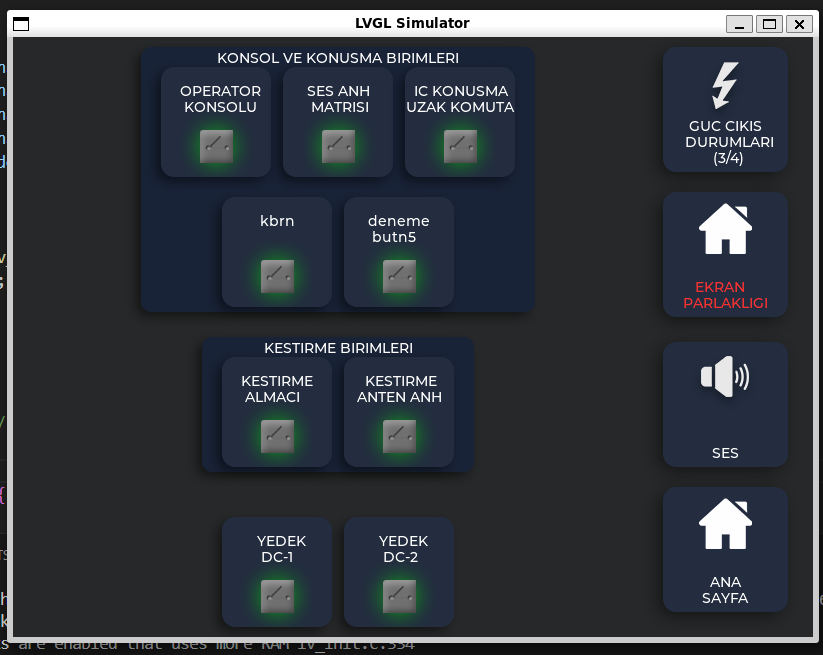

# Panel 1 – Detailed Control Console (LVGL SDL Simulator)

This project demonstrates a detailed control interface using LVGL with the SDL simulator. Panel 1 provides a comprehensive multi-functional console designed for in-depth interaction.

---

## 📸 Preview

---

## 🧩 Project Overview

### 🔹 Left Panel (Dynamic Grouped Buttons)

- Buttons are organized into **multiple logical groups**, each representing different control units.  
- Buttons can be designed to span rows and columns according to user preferences. 
- Large background buttons can be **added or removed based on user choice**, visually representing separate units.  
- Shadows and layered effects add **depth and visual clarity** to the interface.

### 🔹 Right Panel

- Provides main actions such as Power Status, Screen Brightness, Sound, and Home.  
- Panel contains **buttons with fixed positions**, allowing quick access and consistent layout across the interface.

---

## 🎨 UI Design Characteristics

- **Dynamic group layout** for left panel:
  - Buttons arranged automatically based on group and row calculation
  - Supports flexible positioning within groups, both horizontally and vertically
- Visual styling:
  - Large buttons for main units, added according to user preference
  - Shadows and background layers add depth
- Right panel contains **buttons with fixed positions** for core actions

This design makes the interface:

- Structured yet visually rich
- Intuitive for users
- Suitable for complex control scenarios

---

## 🧠 Key Implementation Concept

- **Left panel**: flexible group layout, dynamic row and column placement  
- **Right panel**: buttons with fixed positions for consistent actions  
- **Simulation**: 5-second interactive test triggers changes in the **Screen Brightness button text color** and also updates its **icon to a different image**, demonstrating user preference-based dynamic updates

---

## 🎯 Features

- Multi-group dynamic left panel
- Visual representation of units with large background buttons configurable by user
- Shadows and layered effects for interface depth
- Right panel with buttons in fixed positions
- 5-second simulation demonstrating dynamic button updates
- Interactive, visually rich, and user-oriented design

---

## Simulator Output

- **Initial State**: Main screen with grouped buttons and default visuals.

- **After 5 Seconds**: The **Screen Brightness button on the right panel changes its text color and its icon is replaced by a different image**, reflecting user preference-based dynamic behavior.

---

## 📁 Required Files

**Inside this folder (Panel1)**:

- `main.c`
- `arayuz.c`
- `arayuz.h`

**From the repository root**:

- `images/` (common icons used across panels)
- `lv_conf.h`
- `CMakeLists.txt`

> Both sets of files are required for the simulator to function correctly.
