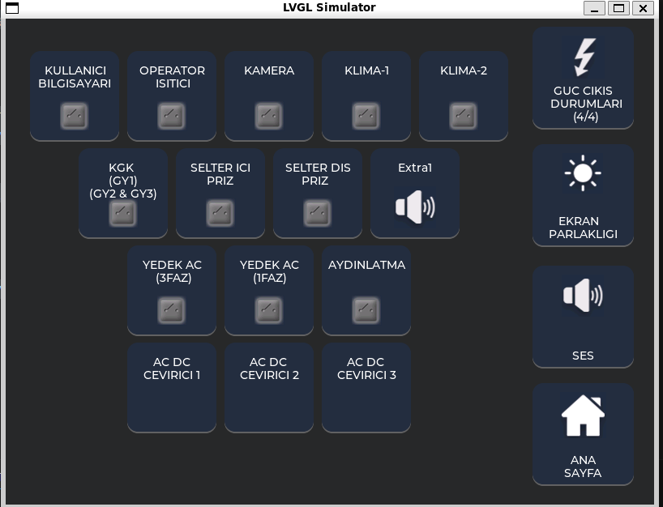

# Panel 2 – LVGL SDL UI Control Panel

This project is a **basic control panel user interface** developed using **LVGL** with the **SDL simulator**.  
It represents a simple UI layout with grouped control buttons and a side control panel.

---

## 📸 Preview

---

## 🧩 Project Overview

Panel 2 is designed as a **multi-group control interface** consisting of:

### 🔹 Left Panel (Grouped Buttons)

- Buttons are organized into **logical groups**.
- Users can **arrange buttons within each group in both rows and columns**, allowing flexible placement.
- The **Extra1 button** is included to demonstrate:
  - Adding a new button
  - Adding a new icon/image
  - Adding a new text label
  
  This proves that button additions and visual/text updates are easy to perform through the code structure.

- Each button contains:
  - Text label
  - Icon (image)

### 🔹 Right Panel (Quick Actions)

- Panel contains **buttons with fixed positions**, providing main actions such as:
  - Power output status
  - Screen brightness
  - Sound control
  - Home navigation

---

## 🎨 UI Design Characteristics

This panel follows a **simpler, flat design**:

- No shadows or depth effects
- Minimal visual styling
- Focus on functional grouping rather than decorative elements

This makes the interface:

- Cleaner and easy to read
- Easy to scale or extend
- Suitable for structured control systems

---

## ⚙️ Technical Details

- Built with **LVGL graphics library**
- Runs on **SDL-based simulation environment**
- Uses:
  - Dynamic layout calculation (`ceil`, grouping logic)
  - Custom UI structuring (`row_group`)
  - Image-based buttons

---

## 📁 Required Files

This panel **does not work standalone with only the files inside the Panel2 folder**.  

You must also include the following from the main repository:

- `lv_conf.h`
- `images/` folder (all image source files)

---

## 🎯 Features

- Group-based dynamic button layout
- Users can add buttons, text, and images easily via code
- Clean panel separation (left controls / right actions)
- SDL simulation ready
- Modular and extendable structure
- Simple, flat design (no shadows or extra styling)

---

## Simulator Output

- **Initial State**: Main screen with grouped buttons and default visuals.

---

## 📁 Required Files

**Inside this folder (Panel2):**

- `main.c`
- `CMakeLists.txt`

**From the repository root:**

- `images/` (all image source files)
- `lv_conf.h`

> All these files are required for the simulator to function correctly.

## 🚀 Summary

Panel 2 demonstrates a structured yet simple LVGL UI design, allowing flexible group placement and easy extension, suitable for embedded interface prototyping and simulation.
