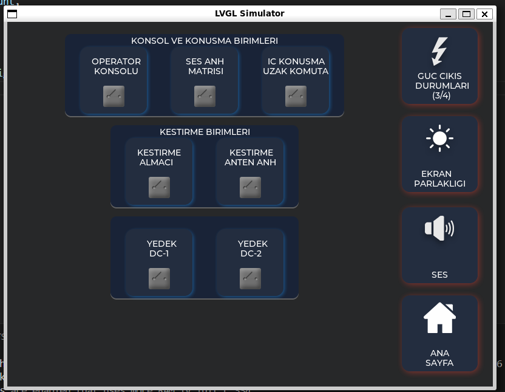
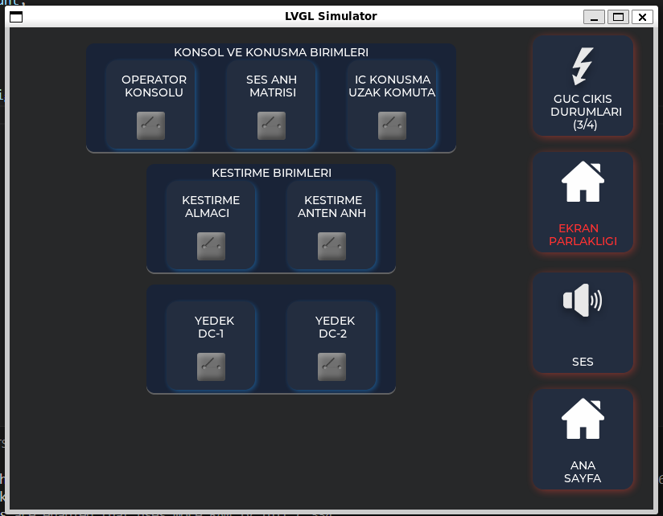

# Panel 2 - Compact Control Console (LVGL SDL Simulator)

Panel 2 showcases a compact control interface using LVGL with the SDL simulator. It is designed for quick access and simplified interaction, maintaining a clean and readable layout.

## Overview

- **Left Panel**: Contains the same groups of buttons as Panel 1 but arranged in a single-row layout. Each group remains visually separated but occupies minimal vertical space, providing a streamlined interface.
- **Right Panel**: Main actions remain the same—Power Status, Screen Brightness, Sound, and Home—with simplified shadows and styling for clarity.

## Dynamic Behavior

- The "Screen Brightness" button changes color after 5 seconds, similar to Panel 1.
- Minimal shadow and background styling provide a clean look while keeping the interface responsive.

## Design Highlights

- Single-row layout creates a compact, minimalist console.
- Focuses on readability and rapid interaction rather than detailed visual effects.
- Streamlined interface makes it suitable for situations where quick access is preferred over complex control grouping.

## Simulator Output

Screenshots below demonstrate Panel 2 in action:

- **Initial State**: Main screen with compact single-row button groups.

- **After 5 Seconds**: Screen Brightness changes color, maintaining dynamic feedback.

## Required Files

**Inside this folder (Panel2)**:
- `main.c`
- `arayuz.c`
- `arayuz.h`

**From the repository root**:
- `images/` (common icons used across panels)
- `lv_conf.h`
- `CMakeLists.txt`

> Note: Both sets of files are required for the simulator to function correctly.
